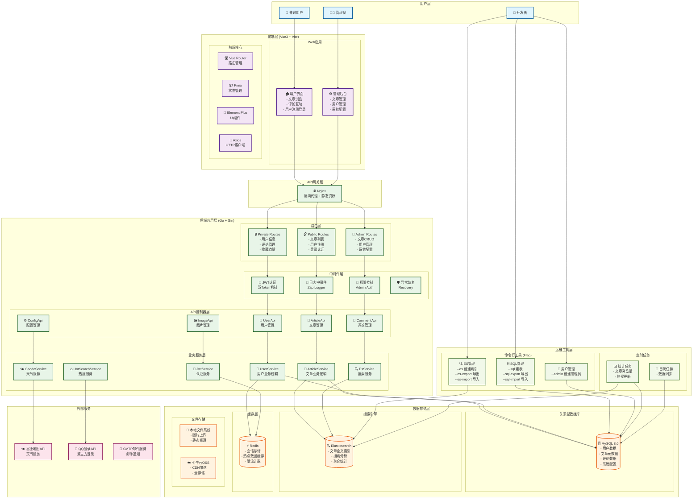
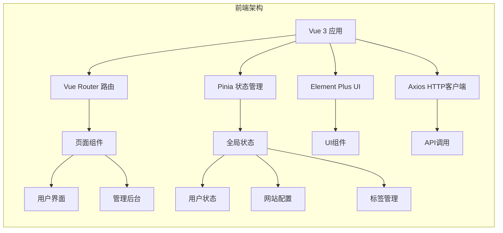
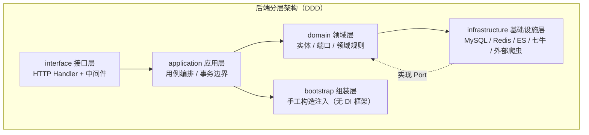
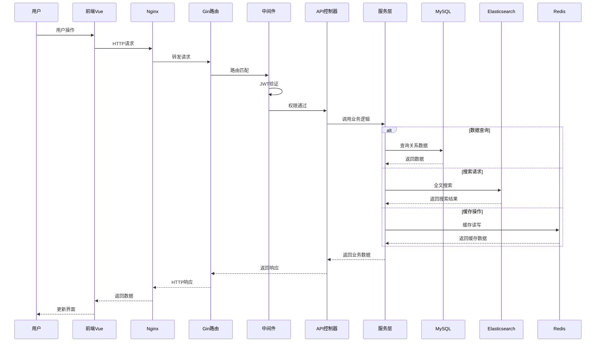
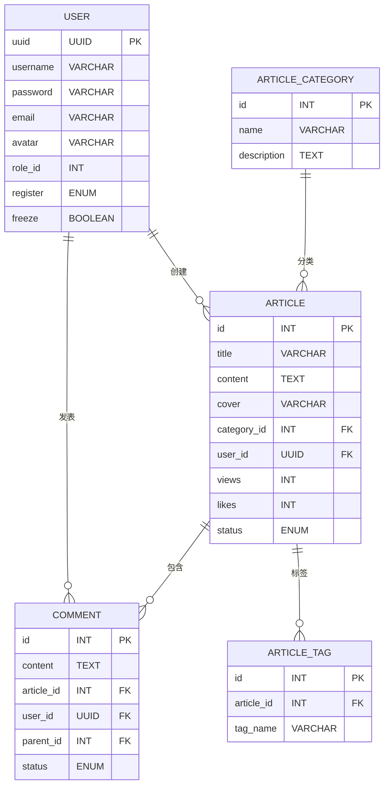
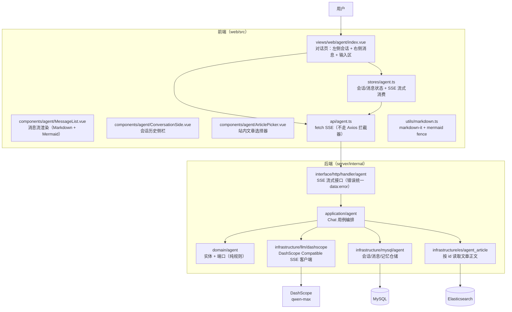
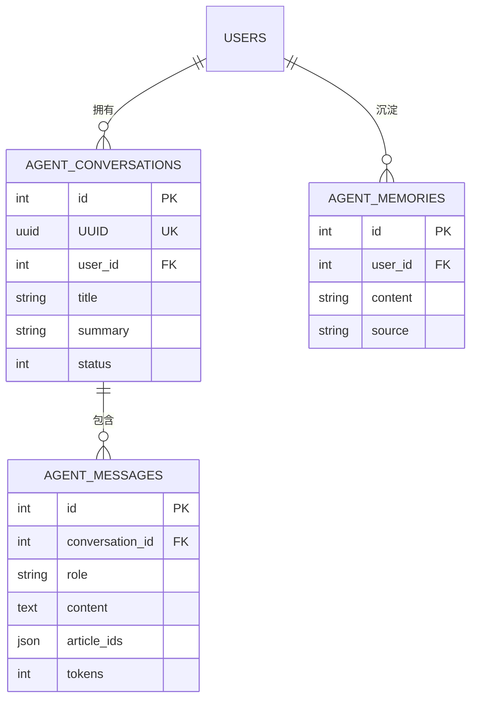
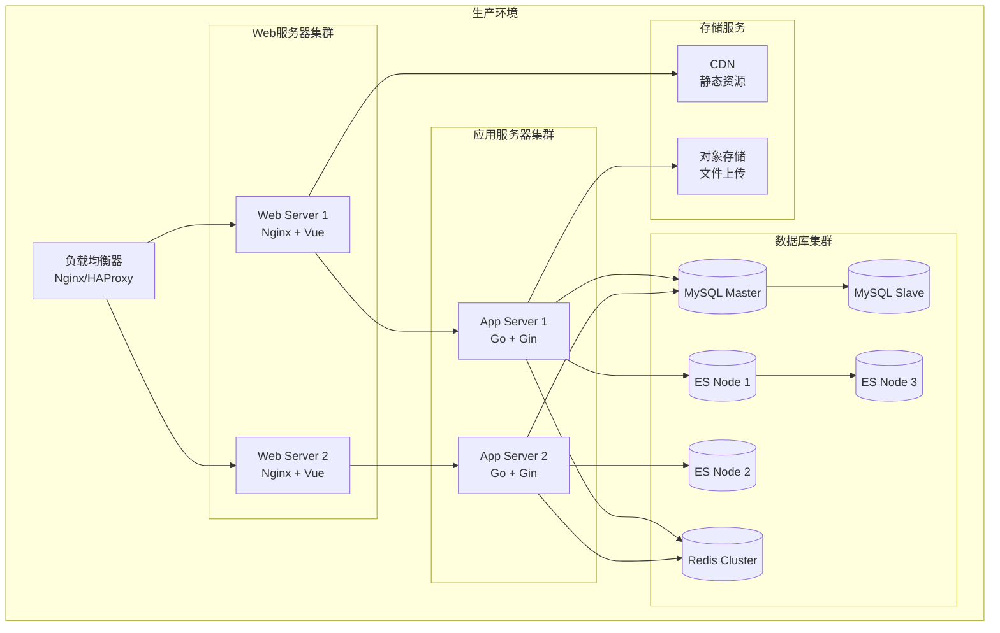

# MyBlog-ES 博客系统架构分析

## 项目概述

MyBlog-ES 是一个基于 Go + Vue3 的现代化博客系统，采用前后端分离架构，集成了 MySQL 和 Elasticsearch 双数据存储方案，提供了完整的博客管理功能。

## 技术栈

### 后端技术栈
- **语言**: Go 1.x
- **Web框架**: Gin
- **ORM**: GORM
- **数据库**: MySQL 8.0
- **搜索引擎**: Elasticsearch 8.x
- **缓存**: Redis
- **日志**: Zap
- **认证**: JWT双Token机制
- **配置管理**: Viper + YAML（支持 `${ENV}` 环境变量展开）
- **命令行工具**: urfave/cli
- **LLM 接入**: DashScope Compatible API（qwen-max，SSE 流式输出）

### 前端技术栈
- **框架**: Vue 3.x
- **构建工具**: Vite
- **状态管理**: Pinia
- **UI组件库**: Element Plus
- **图表库**: ECharts
- **Markdown编辑器**: md-editor-v3
- **Markdown渲染**: markdown-it（Agent 回复）
- **图表渲染**: mermaid（Agent 回复中的流程图/时序图等）
- **HTTP客户端**: Axios（普通 API）；Agent 流式对话走原生 fetch + ReadableStream 解析 SSE
- **语言**: TypeScript

## 系统架构图


```mermaid
graph TB
    %% 用户层
    subgraph "用户层"
        U1["👤 普通用户"]
        U2["👨‍💼 管理员"]
        U3["🔧 开发者"]
    end

    %% 前端层
    subgraph "前端层 (Vue3 + Vite)"
        subgraph "Web应用"
            V1["🏠 用户界面<br/>- 文章浏览<br/>- 评论互动<br/>- 用户注册登录"]
            V2["⚙️ 管理后台<br/>- 文章管理<br/>- 用户管理<br/>- 系统配置"]
        end
        
        subgraph "前端核心"
            VR["🛣️ Vue Router<br/>路由管理"]
            VP["📦 Pinia<br/>状态管理"]
            VE["🎨 Element Plus<br/>UI组件"]
            VA["📡 Axios<br/>HTTP客户端"]
        end
    end

    %% 网关层
    subgraph "API网关层"
        NG["🌐 Nginx<br/>反向代理 + 静态资源"]
    end

    %% 后端应用层
    subgraph "后端应用层 (Go + Gin)"
        subgraph "路由层"
            R1["🔓 Public Routes<br/>- 文章列表<br/>- 用户注册<br/>- 登录认证"]
            R2["🔒 Private Routes<br/>- 用户信息<br/>- 评论管理<br/>- 收藏点赞"]
            R3["👑 Admin Routes<br/>- 文章CRUD<br/>- 用户管理<br/>- 系统配置"]
        end

        subgraph "中间件层"
            M1["📝 日志中间件<br/>Zap Logger"]
            M2["🔐 JWT认证<br/>双Token机制"]
            M3["👮 权限控制<br/>Admin Auth"]
            M4["🛡️ 异常恢复<br/>Recovery"]
        end

        subgraph "API控制器层"
            A1["📄 ArticleApi<br/>文章管理"]
            A2["👤 UserApi<br/>用户管理"]
            A3["💬 CommentApi<br/>评论管理"]
            A4["🖼️ ImageApi<br/>图片管理"]
            A5["⚙️ ConfigApi<br/>配置管理"]
        end

        subgraph "业务服务层"
            S1["📄 ArticleService<br/>文章业务逻辑"]
            S2["👤 UserService<br/>用户业务逻辑"]
            S3["🔍 EsService<br/>搜索服务"]
            S4["🔐 JwtService<br/>认证服务"]
            S5["🌤️ GaodeService<br/>天气服务"]
            S6["🔥 HotSearchService<br/>热搜服务"]
        end
    end

    %% 数据存储层
    subgraph "数据存储层"
        subgraph "关系型数据库"
            DB1[("🗄️ MySQL 8.0<br/>- 用户数据<br/>- 文章元数据<br/>- 评论数据<br/>- 系统配置")]
        end
        
        subgraph "搜索引擎"
            ES1[("🔍 Elasticsearch<br/>- 文章全文索引<br/>- 搜索分析<br/>- 聚合统计")]
        end
        
        subgraph "缓存层"
            RD1[("⚡ Redis<br/>- 会话存储<br/>- 热点数据缓存<br/>- 限流计数")]
        end
        
        subgraph "文件存储"
            FS1["📁 本地文件系统<br/>- 图片上传<br/>- 静态资源"]
            FS2["☁️ 七牛云OSS<br/>- CDN加速<br/>- 云存储"]
        end
    end

    %% 外部服务
    subgraph "外部服务"
        EX1["🌤️ 高德地图API<br/>天气服务"]
        EX2["🐧 QQ登录API<br/>第三方登录"]
        EX3["📧 SMTP邮件服务<br/>邮件通知"]
    end

    %% 运维工具
    subgraph "运维工具层"
        subgraph "命令行工具 (Flag)"
            F1["🗄️ SQL管理<br/>--sql 建表<br/>--sql-export 导出<br/>--sql-import 导入"]
            F2["🔍 ES管理<br/>--es 创建索引<br/>--es-export 导出<br/>--es-import 导入"]
            F3["👑 用户管理<br/>--admin 创建管理员"]
        end
        
        subgraph "定时任务"
            T1["📊 统计任务<br/>- 文章浏览量<br/>- 热搜更新"]
            T2["📅 日历任务<br/>- 数据同步"]
        end
    end

    %% 连接关系
    U1 --> V1
    U2 --> V2
    U3 --> F1
    U3 --> F2
    U3 --> F3

    V1 --> NG
    V2 --> NG
    NG --> R1
    NG --> R2
    NG --> R3

    R1 --> M1
    R2 --> M2
    R3 --> M3
    M1 --> A1
    M2 --> A2
    M3 --> A3
    A1 --> S1
    A2 --> S2
    A3 --> S3
    A4 --> S4
    A5 --> S5

    S1 --> DB1
    S1 --> ES1
    S2 --> DB1
    S2 --> RD1
    S3 --> ES1
    S4 --> RD1
    S5 --> EX1
    S6 --> EX2

    F1 --> DB1
    F2 --> ES1
    F3 --> DB1

    T1 --> DB1
    T1 --> ES1
    T2 --> DB1

    %% 样式定义
    classDef userClass fill:#e1f5fe,stroke:#01579b,stroke-width:2px
    classDef frontendClass fill:#f3e5f5,stroke:#4a148c,stroke-width:2px
    classDef backendClass fill:#e8f5e8,stroke:#1b5e20,stroke-width:2px
    classDef dataClass fill:#fff3e0,stroke:#e65100,stroke-width:2px
    classDef externalClass fill:#fce4ec,stroke:#880e4f,stroke-width:2px
    classDef toolClass fill:#f1f8e9,stroke:#33691e,stroke-width:2px

    class U1,U2,U3 userClass
    class V1,V2,VR,VP,VE,VA frontendClass
    class NG,R1,R2,R3,M1,M2,M3,M4,A1,A2,A3,A4,A5,S1,S2,S3,S4,S5,S6 backendClass
    class DB1,ES1,RD1,FS1,FS2 dataClass
    class EX1,EX2,EX3 externalClass
    class F1,F2,F3,T1,T2 toolClass
```

## 核心模块详解

### 1. 前端架构 (Vue3 + TypeScript)


```mermaid
graph LR
    subgraph "前端架构"
        A["Vue 3 应用"] --> B["Vue Router 路由"]
        A --> C["Pinia 状态管理"]
        A --> D["Element Plus UI"]
        A --> E["Axios HTTP客户端"]
        
        B --> F["页面组件"]
        C --> G["全局状态"]
        D --> H["UI组件"]
        E --> I["API调用"]
        
        F --> J["用户界面"]
        F --> K["管理后台"]
        
        G --> L["用户状态"]
        G --> M["网站配置"]
        G --> N["标签管理"]
    end
```

### 2. 后端分层架构（DDD 四层）


```mermaid
graph TB
    subgraph "后端分层架构（DDD）"
        A["interface 接口层<br/>HTTP Handler + 中间件"] --> B["application 应用层<br/>用例编排 / 事务边界"]
        B --> C["domain 领域层<br/>实体 / 端口 / 领域规则"]
        C --> D["infrastructure 基础设施层<br/>MySQL / Redis / ES / 七牛 / 外部爬虫"]
        D -.->|实现 Port| C
        B --> E["bootstrap 组装层<br/>手工构造注入（无 DI 框架）"]
    end
```

- **interface**：`server/internal/interface/http`（handler 按 BC 分包 + 注入式中间件 + router.go）
- **application**：`server/internal/application/<bc>`（用例编排，依赖 domain 端口）
- **domain**：`server/internal/domain/<bc>`（充血实体 + Port 接口 + 纯规则，不 import 基础设施库）
- **infrastructure**：`server/internal/infrastructure/{mysql,redis,es,geo,storage,hotsearch,calendar,configfile}`
- **bootstrap / common**：`server/internal/bootstrap` 手工 wire；`server/internal/common` 横切工具
- 持久化映射层：`server/internal/model/{database,request,response,other,appTypes,elasticsearch}`（DB 实体 / DTO / ES 索引结构）
- CLI 命令：`server/internal/flag`；入口：`server/cmd/server/main.go`

### 3. 数据流架构


```mermaid
sequenceDiagram
    participant U as 用户
    participant F as 前端Vue
    participant N as Nginx
    participant G as Gin路由
    participant M as 中间件
    participant A as API控制器
    participant S as 服务层
    participant DB as MySQL
    participant ES as Elasticsearch
    participant R as Redis

    U->>F: 用户操作
    F->>N: HTTP请求
    N->>G: 转发请求
    G->>M: 路由匹配
    M->>M: JWT验证
    M->>A: 权限通过
    A->>S: 调用业务逻辑
    
    alt 数据查询
        S->>DB: 查询关系数据
        DB-->>S: 返回数据
    else 搜索请求
        S->>ES: 全文搜索
        ES-->>S: 返回搜索结果
    else 缓存操作
        S->>R: 缓存读写
        R-->>S: 返回缓存数据
    end
    
    S-->>A: 返回业务数据
    A-->>G: 返回响应
    G-->>N: HTTP响应
    N-->>F: 返回数据
    F-->>U: 更新界面
```

### 4. 数据库设计


```mermaid
erDiagram
    USER {
        uuid UUID PK
        username VARCHAR
        password VARCHAR
        email VARCHAR
        avatar VARCHAR
        role_id INT
        register ENUM
        freeze BOOLEAN
    }
    
    ARTICLE {
        id INT PK
        title VARCHAR
        content TEXT
        cover VARCHAR
        category_id INT FK
        user_id UUID FK
        views INT
        likes INT
        status ENUM
    }
    
    COMMENT {
        id INT PK
        content TEXT
        article_id INT FK
        user_id UUID FK
        parent_id INT FK
        status ENUM
    }
    
    ARTICLE_CATEGORY {
        id INT PK
        name VARCHAR
        description TEXT
    }
    
    ARTICLE_TAG {
        id INT PK
        article_id INT FK
        tag_name VARCHAR
    }
    
    USER ||--o{ ARTICLE : "创建"
    USER ||--o{ COMMENT : "发表"
    ARTICLE ||--o{ COMMENT : "包含"
    ARTICLE_CATEGORY ||--o{ ARTICLE : "分类"
    ARTICLE ||--o{ ARTICLE_TAG : "标签"
```

## AI Agent（Folio 智能助手）

### 1. 功能简介

AI Agent 是与首页、论坛同级的独立栏目（`/agent`），定位为 **Folio 博客站点的 Agent 助手**，提供：

- **带记忆的多轮对话**：短期记忆（会话内历史）+ 长期记忆（按用户沉淀的画像记忆）双轨注入
- **携带站内文章提问**：对话前可勾选站内文章，Agent 会基于文章正文作答（可选，不选也能对话）
- **用户级会话历史**：每个用户的会话记录独立展示在左侧栏，点击可恢复历史对话
- **富文本回复**：支持 Markdown（列表、表格、代码块等）与 Mermaid 图表（架构图/流程图/时序图/ER 图等，Agent 生成图表时默认输出 Mermaid）

### 2. 总体架构


```mermaid
graph TB
    subgraph "前端（web/src）"
        V["views/web/agent/index.vue<br/>对话页：左侧会话 + 右侧消息 + 输入区"]
        MS["components/agent/MessageList.vue<br/>消息流渲染（Markdown + Mermaid）"]
        CS["components/agent/ConversationSide.vue<br/>会话历史侧栏"]
        AP["components/agent/ArticlePicker.vue<br/>站内文章选择器"]
        ST["stores/agent.ts<br/>会话/消息状态 + SSE 流式消费"]
        API["api/agent.ts<br/>fetch SSE（不走 Axios 拦截器）"]
        MD["utils/markdown.ts<br/>markdown-it + mermaid fence"]
    end

    subgraph "后端（server/internal）"
        H["interface/http/handler/agent<br/>SSE 流式接口（错误统一 data:error）"]
        APP["application/agent<br/>Chat 用例编排"]
        D["domain/agent<br/>实体 + 端口（纯规则）"]
        LLM["infrastructure/llm/dashscope<br/>DashScope Compatible SSE 客户端"]
        MYSQL["infrastructure/mysql/agent<br/>会话/消息/记忆仓储"]
        ES["infrastructure/es/agent_article<br/>按 id 读取文章正文"]
    end

    U["用户"] --> V
    V --> ST
    V --> API
    ST --> API
    API --> H
    H --> APP
    APP --> D
    APP --> LLM
    APP --> MYSQL
    APP --> ES
    MYSQL --> DB[("MySQL")]
    ES --> ESX[("Elasticsearch")]
    LLM --> DASH["DashScope<br/>qwen-max"]
```

### 3. 后端实现（DDD 分层）

- **interface**：`server/internal/interface/http/handler/agent` —— SSE 输出助手消息，所有错误（含参数预校验）统一编码为 `data:{"error":...}` 事件返回
- **application**：`server/internal/application/agent` —— Chat 用例编排：自动创建会话 → 截取标题（≤30 rune）→ 落库用户消息 → 拼装历史（`max_history` 条）+ 当前消息 → 组装 system（助手设定 + 画像记忆 ≤10 条 + 文章块 ≤`max_article_chars`）→ 流式调用 LLM → 落库助手消息
- **domain**：`server/internal/domain/agent` —— 会话/消息/记忆实体、5 个端口、标题生成与访问控制规则（跨用户访问返回 Forbidden，不存在返回 NotFound）
- **infrastructure**：
  - `llm/dashscope.go`：DashScope Compatible 端点 `POST {base_url}/chat/completions`，`bufio.Scanner` 解析 SSE `data:` 块，`stream_options.include_usage` 收集 token 用量，支持上下文取消
  - `mysql/agent.go`：三张表的 CRUD，归属校验先查后判
  - `es/agent_article.go`：文章正文在 Elasticsearch（非 MySQL），按字符串 id 读取正文注入上下文

### 4. 前端实现

- **API 层**（`api/agent.ts`）：普通接口走 Axios；流式对话用原生 `fetch` + `ReadableStream` 手动解析 SSE，绕过 Axios 拦截器，token 从 `useUserStore().state.accessToken` 直接取
- **状态层**（`stores/agent.ts`）：发送时本地即时追加用户消息 + 助手占位，逐块流式更新，支持中断（AbortController）
- **渲染层**（`MessageList.vue` + `utils/markdown.ts`）：
  - `markdown-it` 渲染 Markdown（`html:false` 防 XSS；fence 规则拦截 ```mermaid 输出为 `<div class="mermaid">`）
  - `MutationObserver` 监听消息区 DOM 变化 + 400ms 防抖触发 `mermaid.run`（流式期间内容未闭合不渲染，结束自动成图；失败保留源码并告警）
  - 头像：助手侧使用 Agent 卡通形象（`/images/agent-avatar.jpg`），用户侧使用账号头像（缺省显示首字母）
- **输入法兼容**：中文输入法组合期间按 Enter 确认候选词不会误发送（`keydown` 事件 `e.isComposing` 判断）

### 5. 记忆组件设计


```mermaid
erDiagram
    AGENT_CONVERSATIONS {
        int id PK
        uuid UUID UK
        int user_id FK
        string title
        string summary
        int status
    }
    AGENT_MESSAGES {
        int id PK
        int conversation_id FK
        string role
        text content
        json article_ids
        int tokens
    }
    AGENT_MEMORIES {
        int id PK
        int user_id FK
        string content
        string source
    }
    USERS ||--o{ AGENT_CONVERSATIONS : "拥有"
    AGENT_CONVERSATIONS ||--o{ AGENT_MESSAGES : "包含"
    USERS ||--o{ AGENT_MEMORIES : "沉淀"
```

| 表 | 职责 | 关键字段 |
|---|---|---|
| `agent_conversations` | 会话记录，按用户隔离 | `user_id` 索引、`uuid` 唯一、`title` ≤100 |
| `agent_messages` | 消息明细，支持恢复历史 | `conversation_id` 索引、`role`、`content`、`article_ids`（JSONUintArray）、`tokens` |
| `agent_memories` | 用户长期画像记忆 | `user_id` 索引、`content` ≤500、`source`（记忆来源） |

**记忆机制（两轨）**：

1. **短期记忆**：同会话历史消息按 `max_history`（默认 20 条）截取注入 prompt，保证多轮上下文
2. **长期记忆**：每次对话将当前用户 `agent_memories` 中最新的 ≤10 条画像记忆注入 system prompt，跨会话生效；记忆内容由 Agent 在对话中根据用户信息沉淀
3. **恢复**：点击左侧会话记录 → 拉取该会话全部消息 → 渲染为历史对话（同样支持 Markdown/Mermaid）

**MVP 说明**：当前实现不依赖向量数据库，文章检索与记忆匹配均通过 MySQL + LLM 完成；系统为向量检索预留了 `ArticleRetriever` / `MemoryRetriever` 端口，后续可平滑升级。

### 6. 配置与密钥安全

```yaml
llm:
  base_url: "https://dashscope.aliyuncs.com/compatible-mode/v1"
  api_key: "${DASHSCOPE_API_KEY}"   # 环境变量注入，绝不写入代码/文档
  model: "qwen-max"
  max_history: 20
  max_article_chars: 8000
```

- 配置加载使用 `os.ExpandEnv` 展开 `${ENV}` 语法，密钥只从环境变量读取
- 模型为 **qwen-max**（DashScope 兼容模式）；**不存在 `qwen-7max` 模型 ID**，调用会返回 `model_not_found`

### 7. Agent 常见问题与排障

| 现象 | 根因 | 解决 |
|---|---|---|
| 调用 `qwen-7max` 返回 `model_not_found` | 阿里云无此模型 ID | 使用 `qwen-max` |
| 选择文章时报 `ArticleSearch.Order required` | 文章搜索接口 `order` 为必填参数，前端传了空串 | 请求携带 `order=desc` |
| 左侧会话栏内容被上方遮挡、无法滚动 | 会话列表 flex 子项缺 `min-height:0`，且页面未给 fixed 导航栏让位 | 列表容器加 `min-height:0`；页面 `padding-top` 预留导航高度 |
| 回复显示 `**加粗**` 等 Markdown 原文 | 消息以纯文本渲染 | 助手消息走 `v-html` + `markdown-it`（`html:false` 防 XSS） |
| Mermaid 代码块不变成图 | 流式期间/时序问题导致 `mermaid.run` 未触发 | `MutationObserver` + 400ms 防抖自动渲染；解析失败保留源码 |
| 中文输入法输入英文按 Enter 直接发送 | `keydown` 未判断输入法组合态 | `e.isComposing` 为 true 时不触发送信 |
| 历史会话仍自称 "MyBlog" 助手 | 旧消息使用旧 system prompt 生成 | 新会话已统一为 Folio 身份；旧消息为历史产物 |
| Agent 报错格式 | 接口统一错误处理 | 所有错误通过 SSE `data:{"error":...}` 返回，前端统一提示 |

## 核心特性

### 1. 双数据存储架构
- **MySQL**: 存储结构化数据（用户、文章元数据、评论等）
- **Elasticsearch**: 提供全文搜索、聚合分析功能
- **Redis**: 缓存热点数据、会话存储

### 2. JWT双Token认证机制
- **Access Token**: 短期有效，用于API访问
- **Refresh Token**: 长期有效，用于刷新Access Token
- 支持多点登录控制

### 3. 命令行工具集成
- 数据库管理：建表、导入导出
- ES索引管理：创建、导入导出
- 用户管理：创建管理员

### 4. 完整的权限控制
- 公开路由：文章浏览、用户注册
- 私有路由：用户信息、评论管理
- 管理员路由：系统管理、内容审核

### 5. 现代化前端架构
- Vue 3 Composition API
- TypeScript 类型安全
- Vite 快速构建
- Element Plus 企业级UI

## 部署架构


```mermaid
graph TB
    subgraph "生产环境"
        LB["负载均衡器<br/>Nginx/HAProxy"]
        
        subgraph "Web服务器集群"
            W1["Web Server 1<br/>Nginx + Vue"]
            W2["Web Server 2<br/>Nginx + Vue"]
        end
        
        subgraph "应用服务器集群"
            A1["App Server 1<br/>Go + Gin"]
            A2["App Server 2<br/>Go + Gin"]
        end
        
        subgraph "数据库集群"
            M1[("MySQL Master")]
            M2[("MySQL Slave")]
            E1[("ES Node 1")]
            E2[("ES Node 2")]
            E3[("ES Node 3")]
            R1[("Redis Cluster")]
        end
        
        subgraph "存储服务"
            CDN["CDN<br/>静态资源"]
            OSS["对象存储<br/>文件上传"]
        end
    end
    
    LB --> W1
    LB --> W2
    W1 --> A1
    W2 --> A2
    A1 --> M1
    A2 --> M1
    M1 --> M2
    A1 --> E1
    A2 --> E2
    E1 --> E3
    A1 --> R1
    A2 --> R1
    W1 --> CDN
    A1 --> OSS
```

## 总结

MyBlog-ES 是一个设计精良的现代化博客系统，具有以下优势：

1. **技术栈先进**: 采用 Go + Vue3 + TypeScript 的现代技术栈
2. **架构清晰**: 前后端分离，分层架构，职责明确
3. **性能优秀**: 双数据存储，缓存机制，搜索优化
4. **功能完整**: 用户管理、内容管理、搜索、评论等完整功能
5. **运维友好**: 命令行工具，日志系统，配置管理
6. **扩展性强**: 微服务架构，水平扩展能力

该系统适合作为企业级博客平台或个人技术博客的基础架构，具有良好的可维护性和扩展性。
