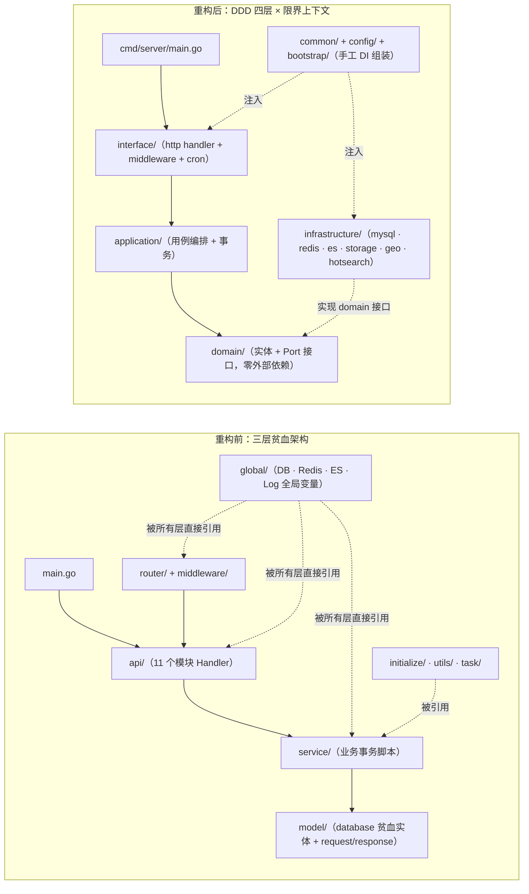
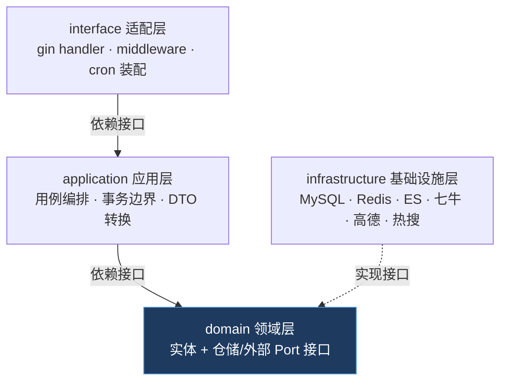

# MyBlog Server DDD 重构架构文档

> 记录 2026-10-02 完成的 DDD 重构（提交 `c3456a9..fe91555`）：目录结构、分层依赖与各限界上下文的 Port / Repository 接口清单。接口签名与 `server/internal/domain/` 源码逐字一致。

## 1. 重构前 vs 重构后目录结构



## 2. 分层依赖方向（依赖倒置核心）



约束：`domain` 不得 import gorm/gin/elasticsearch 等基础设施库；替换任何基础设施只改 `infrastructure/`，业务代码零改动。

## 3. 限界上下文与 Port 接口清单

| BC | 端口 / 仓储接口 | domain 定义位置 | infrastructure 实现 |
|---|---|---|---|
| auth | `AuthPort` `SessionStore` `BlacklistStore` | `domain/auth` | `application/auth`（AuthPort）、`infrastructure/redis`（Session）、`infrastructure/mysql`（Blacklist） |
| user | `UserRepository` `LoginRecordRepository` `Cache` `GeoProvider` | `domain/user` | `infrastructure/mysql`、`infrastructure/redis`、`infrastructure/geo` |
| article | `ArticleRepository` `EsArticleStore` `ViewCounter` | `domain/article` | `infrastructure/mysql`、`infrastructure/es`、`infrastructure/redis` |
| comment | `CommentRepository`（+ 去重规则 `DedupByRootUser`） | `domain/comment` | `infrastructure/mysql` |
| forum | `ForumRepository` | `domain/forum` | `infrastructure/mysql` |
| image | `ImageRepository` | `domain/image` | `infrastructure/mysql` |
| website | `HotSearchProvider` `CalendarProvider` `WebsiteImagePort` `FooterLinkRepository` | `domain/website` | `infrastructure/hotsearch`、`infrastructure/calendar`、`infrastructure/mysql` |
| advertisement | `AdvertisementRepository` | `domain/advertisement` | `infrastructure/mysql` |
| friendlink | `FriendLinkRepository` | `domain/friendlink` | `infrastructure/mysql` |
| feedback | `FeedbackRepository` | `domain/feedback` | `infrastructure/mysql` |
| config | `ConfigStore` | `domain/config` | `infrastructure/configfile` |

### auth（认证支撑域）

```go
type SessionStore interface {          // Redis 会话：uuid → refresh token
    Set(ctx context.Context, key, value string, ttl time.Duration) error
    Get(ctx context.Context, key string) (string, error)
    Del(ctx context.Context, key string) error
}

type BlacklistStore interface {        // JWT 黑名单：MySQL 持久化 + 本地缓存
    Add(ctx context.Context, jwt string) error
    Contains(ctx context.Context, jwt string) bool
    LoadAll(ctx context.Context) error
}

type AuthPort interface {              // 认证领域端口（application/auth 实现）
    GenerateToken(ctx context.Context, sub TokenSubject, useMultipoint bool) (TokenPair, error)
    ParseAccess(ctx context.Context, token string) (AccessClaims, error)
    ParseRefresh(ctx context.Context, token string) (RefreshClaims, error)
    Blacklist(ctx context.Context, jwt string) error
    IsBlacklisted(ctx context.Context, jwt string) bool
    SetSession(ctx context.Context, uuid string, refresh string) error
    GetSession(ctx context.Context, uuid string) (string, error)
    DelSession(ctx context.Context, uuid string) error
    Authenticate(ctx context.Context, accessToken, refreshToken string) (*AuthResult, error)
    LoadAll(ctx context.Context) error
}
```

### user（核心域）

```go
type UserRepository interface {
    FindByEmail(ctx context.Context, email string) (*User, error)
    FindByUUID(ctx context.Context, uuid uuid.UUID) (*User, error)
    FindByID(ctx context.Context, id uint) (*User, error)
    Create(ctx context.Context, u *User) error
    Update(ctx context.Context, u *User) error
    UpdateFreeze(ctx context.Context, id uint, frozen bool) (*User, error)
    UpdateInfo(ctx context.Context, id uint, username, address, signature string) error
    UpdateAvatar(ctx context.Context, id uint, avatarURL string) (*User, error)
    CountByDate(ctx context.Context, days int) (map[string]int, error)
    Page(ctx context.Context, cond ListCond) ([]*User, int64, error)
    FindIDByUUID(ctx context.Context, uuidVal uuid.UUID) (uint, error)
}

type LoginRecordRepository interface {
    Create(ctx context.Context, r *LoginRecord) error
    CountByDate(ctx context.Context, days int) (map[string]int, error)
    Page(ctx context.Context, cond LoginListCond) ([]*LoginRecord, int64, error)
}

type Cache interface {                 // 通用键值缓存（Redis，天气等聚合数据）
    Get(ctx context.Context, key string) (string, error)
    Set(ctx context.Context, key, value string, ttl time.Duration) error
    Del(ctx context.Context, key string) error
}

type GeoProvider interface {           // 高德防腐层
    LocationByIP(ctx context.Context, ip string) (GeoInfo, error)
    WeatherByAdcode(ctx context.Context, adcode string) (WeatherInfo, error)
}
```

### article（核心域，含外部系统防腐）

```go
type ArticleRepository interface {     // 分类/标签计数与图片类别更新的事务联动封装在实现内部
    Categories(ctx context.Context) ([]ArticleCategory, error)
    Tags(ctx context.Context) ([]BlogTag, error)
    CheckTagsExist(ctx context.Context, tags []string) error
    LikeTx(ctx context.Context, userID uint, articleID string) (int, error)
    IsLike(ctx context.Context, userID uint, articleID string) (bool, error)
    LikesList(ctx context.Context, userID uint, page, pageSize int) ([]ArticleLike, int64, error)
    CreateWithCounts(ctx context.Context, a *Article, cover string, illustrations []string) error
    UpdateWithCounts(ctx context.Context, a *Article, old *Article, newCover string, newIllustrations []string, addedIllustrations, removedIllustrations []string) error
    DeleteWithCounts(ctx context.Context, a *Article, cover string, illustrations []string) error
}

type EsArticleStore interface {        // Elasticsearch 端口
    Index(ctx context.Context, a *Article) error
    Update(ctx context.Context, id string, doc any) error
    Get(ctx context.Context, id string) (*Article, error)
    DeleteByIDs(ctx context.Context, ids []string) error
    Exists(ctx context.Context, title string) (bool, error)
    AddLikes(ctx context.Context, id string, delta int) error
    AddViews(ctx context.Context, id string, num int) error
    Search(ctx context.Context, spec SearchSpec) (SearchResult, error)
}

type ViewCounter interface {           // 浏览量计数（Redis hash）
    Set(ctx context.Context, id string) error
    GetInfo(ctx context.Context) map[string]int
    Clear(ctx context.Context)
}
```

### comment

```go
type CommentRepository interface {     // 树加载与级联删除行为收敛于此
    ByArticle(ctx context.Context, articleID string) ([]*Comment, error)
    Newest(ctx context.Context, limit int) ([]*Comment, error)
    Create(ctx context.Context, c *Comment) error          // database.Comment 钩子同步 ES 评论数
    DeleteTree(ctx context.Context, ids []uint, userUUID uuid.UUID, roleID shared.RoleID) error
    ByUser(ctx context.Context, userUUID uuid.UUID) ([]*Comment, error)
    List(ctx context.Context, cond ListCond) ([]*Comment, int64, error)
}
// 领域规则：同用户子孙评论从根列表剔除（行为与原 FindChildCommentsIDByRootCommentUserUUID 一致）
func DedupByRootUser(rootComments []*Comment) []*Comment
```

### forum

```go
type ForumRepository interface {
    Tags(ctx context.Context) ([]Tag, error)
    Publish(ctx context.Context, post *ForumPost) (uint, error)   // 事务：帖子 + 标签引用数
    List(ctx context.Context, cond ListCond) ([]*ForumPost, int64, error)
    Detail(ctx context.Context, id uint) (*ForumPost, []*ForumComment, error)
    Like(ctx context.Context, postID, userID uint) (bool, int, error)
    Comment(ctx context.Context, c *ForumComment) error
    ManageList(ctx context.Context, cond ManageListCond) ([]*ForumPost, int64, error)
    DeletePosts(ctx context.Context, ids []uint, userID uint, roleID shared.RoleID) error
    ManageComments(ctx context.Context, cond ManageCommentCond) ([]*ManageComment, int64, error)
    DeleteComments(ctx context.Context, ids []uint, userID uint, roleID shared.RoleID) error
}
```

### image

```go
type ImageRepository interface {
    Create(ctx context.Context, name, url, storage string) error
    Delete(ctx context.Context, ids []uint) ([]Image, error)     // 返回被删记录供存储侧删文件
    List(ctx context.Context, cond ListCond) ([]Image, int64, error)
}
```

### website（站点聚合域）

```go
type WebsiteImagePort interface {
    CarouselURLs(ctx context.Context) ([]string, error)
    ChangeCategory(ctx context.Context, urls []string, category string) error
    InitCategory(ctx context.Context, urls []string) error
}

type FooterLinkRepository interface {
    List(ctx context.Context) ([]*FooterLink, error)
    Save(ctx context.Context, link *FooterLink) error
    Delete(ctx context.Context, link *FooterLink) error
}

type HotSearchProvider interface {     // 多平台热搜（含缓存语义）
    GetHotSearchData(ctx context.Context, source string) (HotSearchData, error)
    WarmAll(ctx context.Context) error
}

type CalendarProvider interface {
    GetCalendarByDate(ctx context.Context, dateStr string) (Calendar, error)
}
```

### advertisement / friendlink / feedback / config

```go
type AdvertisementRepository interface {
    Info(ctx context.Context) ([]*Advertisement, int64, error)
    Create(ctx context.Context, ad *Advertisement) error        // 事务：图片类别"广告" + 创建
    Delete(ctx context.Context, ids []uint) error               // 事务：图片类别重置 + 删除
    Update(ctx context.Context, ad *Advertisement) error
    List(ctx context.Context, cond ListCond) ([]*Advertisement, int64, error)
}

type FriendLinkRepository interface {
    Info(ctx context.Context) ([]*FriendLink, int64, error)
    Create(ctx context.Context, link *FriendLink) error         // 事务：图片类别"友链" + 创建
    Delete(ctx context.Context, ids []uint) error               // 事务：图片类别重置 + 删除
    Update(ctx context.Context, link *FriendLink) error
    List(ctx context.Context, cond ListCond) ([]*FriendLink, int64, error)
}

type FeedbackRepository interface {
    Newest(ctx context.Context, limit int) ([]*Feedback, error)
    Create(ctx context.Context, f *Feedback) error
    Info(ctx context.Context, userUUID uuid.UUID) ([]*Feedback, error)
    Delete(ctx context.Context, ids []uint) error
    Reply(ctx context.Context, id uint, reply string) error
    List(ctx context.Context, page, pageSize int) ([]*Feedback, int64, error)
}

type ConfigStore interface {
    Save(ctx context.Context) error                              // 保存 YAML 到文件
}
```

## 4. 关键设计决策

- **依赖倒置**：所有仓储/外部系统以接口定义在 `domain/`，实现全部落在 `infrastructure/`；`application` 只依赖接口，事务边界收敛在用例层与仓储实现内部（如文章分类/标签计数、论坛删除级联）。
- **零新增依赖**：依赖注入为手写 `bootstrap` 构造组装，未引入 go-zero/wire/dig 等框架；测试用手写 stub。
- **行为兼容**：89 条接口快照回归 88/89 等价（唯一差异为 captcha 随机值）；错误文案、301/500 既有行为逐字保留。
- **共享复用**：`domain/website` 复用 `friendlink` 实体（`FooterLink`），`domain/forum` 复用 `article.BlogTag`，避免跨 BC 重复建模。
