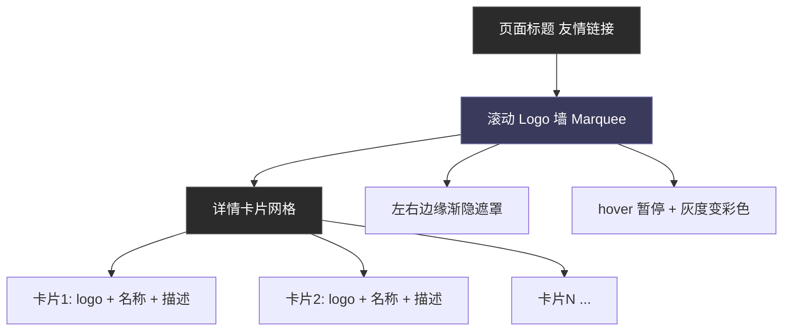

# 友链展示重构 功能规格说明书（Spec）

> 版本：v1.0・日期：2026-10-03・状态：已实施（2026-10-03 本地验证通过）

## 1. 背景与问题

### 1.1 现状

- 友链页（`web/src/views/web/friend-link/index.vue`）为纯静态网格卡片：每张卡片 = 左侧 logo（固定 48×48px）+ 右侧名称 + 描述。
- 当前共有 4 个友链，网格仅一排，页面信息密度低、视觉平淡。
- 截图显示部分长方形 logo（如豆包智能体、南阳理工学院）被强制压成正方形，明显变形。

### 1.2 问题根因（技术）

1. **logo 变形**：`el-image` 被写死 `style="width: 48px; height: 48px"`，且未设置 `fit` 属性。Element Plus 的 `el-image` 默认 `fit="fill"`，会将图片**强制拉伸**填满容器 → 长方形 logo 被压成正方形。
2. **展示形式单一**：只有一种静态卡片网格，无层次、无动效，配不上站点的深色现代风格。

## 2. 行业调研结论

调研了中文博客生态（Hexo/Butterfly 主题、Typecho、自研站）与海外 B2B 站点（logo 墙、logo marquee 惯例）的主流友链/伙伴展示方式，对比如下：

| 方案 | 形态 | 优点 | 缺点 | 适用场景 |
| --- | --- | --- | --- | --- |
| A. 卡片网格（现状） | logo + 名称 + 描述，响应式 grid | 信息全、实现简单 | 静态无动效、logo 易被压扁 | 链接数量多且需要描述 |
| B. 无限滚动 Logo 墙（Marquee） | 横向无缝滚动，纯 CSS，hover 暂停 | 动效强、视觉高级、logo 墙惯例 | 名称/描述信息弱 | 伙伴/友链"门面"，数量 3+ 即可用 |
| C. 头像墙 | 圆形头像 + 下方名字，grid 排列 | 简洁、社区感强 | 只适合方形头像，长方形 logo 放不下 | 社交型站点 |
| D. 分类卡片 | 按分类分组，每组一个标题 + 卡片 | 结构清晰 | 需后端增加 category 字段，改动大 | 友链多且有分类需求 |
| E. 朋友圈式 | 聚合友链站点最新文章 | 强互动 | 依赖各站 RSS/API，成本高 | 成熟站点进阶玩法 |

**结论：采用「B 滚动 Logo 墙 + A 详情卡片」双段式组合**——顶部跑马灯承担"门面展示 + 动效惊喜"，下方卡片网格保留名称与描述的信息完整性，二者互补，且**零后端改动、零新依赖**。

## 3. 目标与成功标准

### 3.1 业务目标

- 修复 logo 变形问题：所有友链图标在任何尺寸下保持原始宽高比。
- 提升友链页视觉表现：从静态网格升级为"滚动墙 + 详情卡片"的层次化页面。
- 保持站点现有深色风格与交互语言一致。

### 3.2 成功指标（验收时逐条检查）

- [ ] 所有 logo 无拉伸变形（与重构前截图对比）。
- [ ] 跑马灯无缝循环、平滑（肉眼无跳变、无闪烁）。
- [ ] hover 暂停滚动、logo 灰度变彩色。
- [ ] `prefers-reduced-motion` 下动画禁用且布局不破。
- [ ] 375px 宽度下不横向溢出、布局完整。
- [ ] 深色/浅色主题下均可读（全部使用现有 CSS 变量）。
- [ ] `npm run type-check` 通过，浏览器控制台无报错。

## 4. 功能需求（MoSCoW）

| 编号 | 模块 | 功能点 | 优先级 |
| --- | --- | --- | --- |
| F1 | 滚动墙 | 页面标题下方新增无限滚动 Logo 墙（跑马灯） | Must |
| F2 | 滚动墙 | 跑马灯纯 CSS 实现无缝循环（内容复制一份，`translateX(-50%)`） | Must |
| F3 | 滚动墙 | 鼠标悬停时暂停滚动；移出恢复 | Must |
| F4 | 滚动墙 | 单个 logo 保持原始宽高比（`object-fit: contain` + 固定高度 + 宽度自适应） | Must |
| F5 | 滚动墙 | logo 默认灰度，hover 变彩色（过渡 200ms） | Should |
| F6 | 滚动墙 | 左右两侧边缘渐隐遮罩（`mask-image`） | Should |
| F7 | 滚动墙 | 点击 logo 或其名称跳转友链（新标签页） | Must |
| F8 | 卡片 | 卡片网格保留 logo + 名称 + 描述，logo 不再压扁 | Must |
| F9 | 卡片 | 保留现有 hover 上浮、边框高亮、入场动画 | Must |
| F10 | 响应式 | 移动端（<768px）缩小 logo 与间距，不横向溢出 | Must |
| F11 | 无障碍 | `prefers-reduced-motion: reduce` 时禁用滚动动画 | Must |
| F12 | 主题 | 全部颜色/间距使用现有 CSS 变量（--bg / --bg-elevated / --border / --text-primary / --text-muted / --accent / --radius-sm / --sp-* / --fs-*） | Must |

## 5. 交互与视觉规范（量化）

### 5.1 滚动 Logo 墙

| 项 | 值 |
| --- | --- |
| 位置 | 页面标题（友情链接）下方、卡片网格上方 |
| logo 尺寸 | 高 44px，宽自适应，`max-width: 140px`，`object-fit: contain` |
| 名称标签 | 12px / `--text-muted`，单行省略，位于 logo 下方 |
| 间距 | 条目间 `margin-right: 32px`（不用 flex gap，保证无缝循环对齐） |
| 动画 | `@keyframes` `translateX(0 → -50%)`，时长 32s，`linear` 无限循环 |
| 默认态 | `filter: grayscale(1)` + `opacity: .75` |
| hover 态 | 暂停滚动 + `grayscale(0)` + `opacity: 1`，过渡 200ms ease-out |
| 边缘遮罩 | `mask-image: linear-gradient(90deg, transparent, #000 10%, #000 90%, transparent)`（含 -webkit- 前缀） |
| 点击 | 整条目可点，`window.open(link)` |

### 5.2 详情卡片网格

| 项 | 值 |
| --- | --- |
| 布局 | 保持现有 `grid: repeat(auto-fill, minmax(320px, 1fr))`，gap 16px |
| logo | 高 48px，宽自适应，`max-width: 96px`，`object-fit: contain`，圆角 `--radius-sm` |
| 名称 | 16px / 600 / `--text-primary`（hover 变 `--accent`，现有逻辑不变） |
| 描述 | 14px / `--text-muted`（现有逻辑不变） |
| 交互 | hover 上浮 -2px + `--shadow-md` + 边框高亮（现有逻辑不变） |

### 5.3 响应式（<768px）

- 滚动墙 logo 高 36px，条目间距 24px，动画时长不变。
- 卡片网格依赖 auto-fill 自动降列，无需额外处理。

## 6. 技术方案

### 6.1 文件结构

| 动作 | 文件 | 说明 |
| --- | --- | --- |
| 新增 | `web/src/components/pages/FriendLinkMarquee.vue` | 滚动 Logo 墙组件，props 接收 `FriendLink[]` |
| 修改 | `web/src/views/web/friend-link/index.vue` | 引入滚动墙；卡片 logo 由 `el-image` 改为原生 `` + contain |

### 6.2 关键实现要点

1. **无缝循环**：单条轨道内把列表复制一份渲染（`[...items, ...items]`），条目用 `margin-right` 而非 `flex gap`，轨道 `width: max-content`，动画 `translateX(0 → -50%)` 后两段完全对齐。
2. **不变形**：一律原生 `` + `height` 固定 + `width: auto` + `max-width` 约束 + `object-fit: contain`（`el-image` 的容器需要显式宽高，其内部仍按容器尺寸裁切，故不再使用）。
3. **暂停滚动**：`.friend-link-marquee:hover .marquee-track { animation-play-state: paused; }`，纯 CSS 无需 JS。
4. **降低动态偏好**：`@media (prefers-reduced-motion: reduce)` 下 `animation: none`，轨道 `flex-wrap: wrap` 居中；内容按「双分组」结构复制（`v-for="[0,1]"` 渲染两个 `.marquee-group`），隐藏第二组即可只展示一轮（`.marquee-group:nth-child(2) { display: none; }`）。
5. **无障碍/降级**：`` + `alt`；图片加载失败时显示条目背景色（`--bg-elevated`），不阻塞布局。
6. **不改后端**：数据模型 `FriendLink { logo, link, name, description }` 保持不变；不新增 i18n 词条（滚动墙直接展示 `name`）。

### 6.3 页面布局示意

## 7. 验收标准（逐项可验证）

1. 打开 `/friend-link`，滚动墙在标题下方无缝循环滚动，无跳变。
2. 对比重构前后截图：所有 logo 宽高比正确、无拉伸、无裁切。
3. 鼠标悬停滚动墙任意位置：滚动暂停；悬停单个 logo：由灰变彩色；移出后恢复滚动。
4. DevTools 开启 `prefers-reduced-motion: reduce`：无动画，仅展示一轮条目且居中排列。
5. 窗口缩至 375px：无横向滚动条，滚动墙与卡片布局完整。
6. 切换浅色主题：文字与背景对比度正常。
7. `cd web && npm run type-check` 通过；DevTools 控制台无报错。
8. 点击滚动墙条目与卡片均在新标签页打开对应友链。

## 8. 非目标（Out of Scope）

- 不修改后端接口、数据库表结构与友链数据（含 description 与 name 重复的存量数据问题，另议）。
- 不新增友链分类、朋友圈聚合等需后端配合的功能。
- 不引入任何第三方动画/轮播依赖（如 VueUse、swiper 等）。
- 不修改管理后台（`dashboard/system/friend-link-list.vue`）的增删改查逻辑。
