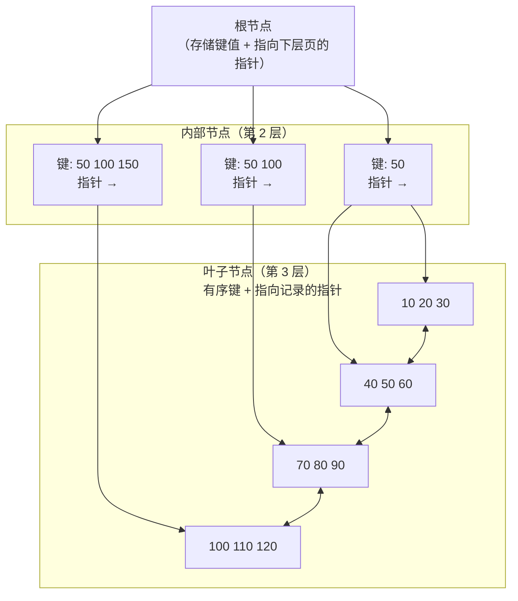
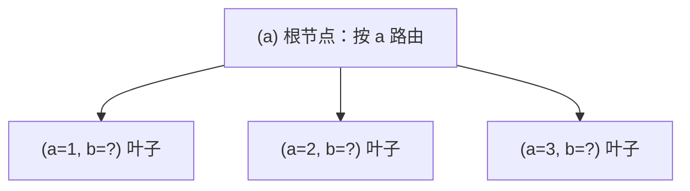

# MySQL 的 B+ 树索引：从磁盘 I/O 到千万级数据的底层原理

> 后端面试十有八九会问「为什么 MySQL 用 B+ 树做索引」。本文不讲背诵版答案，而是沿着一条主线推演：
> **数据要落盘 → 磁盘随机读很贵 → 索引结构必须矮而宽 → B+ 树就是为这个场景量身定制的**
> 。看完你不仅能回答面试题，还能解释清楚聚簇索引、回表、最左前缀这些词背后的设计动机。

## 一、先回答最朴素的问题：索引为什么能让查询变快

没有索引时，一条 `WHERE` 查询只能**全表扫描**：把表里的每一行都读出来，逐行比对。数据量小无所谓，几百万行之后，一次扫描要读几百 MB 甚至几个 GB，全表扫描的时间随数据量线性增长。

索引的本质是**一份有序的查找结构**：把「扫描所有行」降级为「在有序结构中二分 / 树查找」。查找的复杂度从 O (n) 降到 O (log n)，n 越大收益越明显 —— 这正是所有索引设计的共同出发点。

但这里有个工程约束：MySQL 的表数据存在磁盘上，索引也存磁盘上。**任何查找都绕不开磁盘 I/O**。所以评估一个索引结构好不好的第一标准，不是理论上的比较次数，而是**一次查询要读多少次磁盘**。

## 二、磁盘 I/O：索引结构设计的第一性原理

机械硬盘的随机读延迟在 **5\~10ms** 量级，SSD 大约 **0.1\~0.5ms**。作为对比，内存访问是纳秒级（几十 ns）。也就是说，**一次磁盘随机读比一次内存访问慢 10 万倍**。

因此数据库的设计准则非常朴素：

> 尽量少读磁盘，一次尽量多读点。

InnoDB 用 \*\* 页（Page）\*\* 作为磁盘与内存之间的最小交换单位，默认一页 **16KB**。每次 I/O 至少读入一整页，页内数据在内存里可以随便访问。所以「查询读了几次磁盘」约等于「查询访问了几个页」。

由此，索引结构的目标就明确了：

1. **矮**：树的高度越低，从根到叶的磁盘读次数越少（每层一次 I/O）；

2. **宽**：每个节点能装下尽可能多的「孩子指针」，让同样的数据量只需要更矮的树；

3. **有序且局部连续**：让范围查询和顺序扫描尽量命中连续的页，减少随机 I/O。

B+ 树恰好同时满足这三点。

## 三、B+ 树长什么样

B+ 树是多路平衡搜索树，一棵 3 层的 B+ 树大致如下：

三个特征值得记住：

* **只有叶子节点存「数据」**（InnoDB 中叶子存整行数据或主键值），内部节点只存「索引键 + 指向下一层页的指针」，用于路由；

* **叶子节点之间通过双向链表串联**，按键值有序排列 —— 这让范围查询（`BETWEEN`、`>`、`ORDER BY`）可以顺着链表顺序扫描，而不是回到树上逐节点查找；

* **所有叶子在同一深度**，树是严格平衡的，任何一条路径的磁盘读次数相同，最坏情况可预期。

## 四、为什么是 B+ 树：把竞争者逐个排除

面试里常见的追问是「为什么不用 B 树 / 红黑树 / 哈希表」。逐个来看：

| 结构       | 叶子不存数据？    | 范围查询         | 树高 / 扇出          | 结论                         |
| -------- | ---------- | ------------ | ---------------- | -------------------------- |
| 哈希表      | —          | ❌ 不支持（除非全表扫） | O (1) 但无序        | 只适合等值查询，MySQL 也有自适应哈希索引做辅助 |
| 红黑树      | 每个节点都存数据   | ✅（中序遍历）      | 二叉树，高度 O (log₂n) | 内存结构优秀，但磁盘场景扇出太小、太高        |
| B 树      | ❌ 所有节点都存数据 | ✅ 但无序连续      | 高扇出              | 内部节点也占数据空间，扇出变小，且范围查询要反复回树 |
| **B+ 树** | ✅ 只在叶子存    | ✅ 叶子链表顺序扫    | 高扇出、矮            | **磁盘场景综合最优**               |

关键差异在于**扇出（fanout）**—— 一个节点最多能指向多少个孩子。以 InnoDB 的 16KB 页为例：

* 假设索引键占 8 字节、指针占 6 字节，一个索引项约 14 字节（真实场景再加页头等开销，按 15\~16 字节估算）；

* 那么一个 16KB 页大约能装 **1170 个索引项**（16384 ÷ 14 ≈ 1170），也就是内部节点的扇出约 **1170**；

* 这带来一个惊人的结果：**高度为 3 的 B+ 树，能容纳约 1170² ≈ 137 万个叶子页**。按一页装 15 行（假设行均 1KB 左右）估算，**3 层树就能装下约 2000 万行数据**。

红黑树每层只分 2 叉，同样是 2000 万行数据需要 log₂(2×10⁷) ≈ **24 层**—— 意味着每次查询要读 24 次磁盘，而 B+ 树只要 3 次。这就是「矮而宽」的威力。

B 树和 B+ 树的差别在于：B 树内部节点也存数据，同一页能存的索引项变少、扇出变小；而且 B 树的范围查询必须回溯到内部节点逐个查找，无法利用叶子链表顺序扫描。所以工程上 InnoDB 最终选择了 B+ 树。

## 五、InnoDB 的聚簇索引与二级索引

InnoDB 的表数据本身就是一棵 B+ 树，这是它和 MyISAM 最大的区别。所有索引分两类：

**聚簇索引（Clustered Index）**：以主键为键值，叶子节点直接存储**完整的一行数据**。一张表只能有一个聚簇索引（主键，或第一个非空唯一索引，或系统隐式 rowid）。聚簇索引决定了**数据的物理存储顺序**—— 表数据按主键有序排列，所以插入顺序接近主键顺序时写入性能最好。

**二级索引（Secondary Index）**：叶子节点存储的是**索引列的值 + 主键值**，而不是完整行。每个二级索引都是一棵独立的 B+ 树。

由此引出一个重要概念：

## 六、回表与覆盖索引

用二级索引查询时，索引树里只有「索引列 + 主键」，没有整行数据。要拿到其他列，必须用命中的主键再去聚簇索引里找一次 —— 这次查找就叫**回表**。

回表意味着**多一次磁盘 I/O**。优化手段是**覆盖索引（Covering Index）**：让查询需要的所有列都包含在二级索引里，这样只查二级索引就能拿到结果，**完全不需要回表**。这也是为什么 `SELECT` 不要无脑 `SELECT *`，而是只取必要的列 —— 列越少，越有机会命中覆盖索引，也越容易让索引覆盖查询。

## 七、最左前缀：联合索引的结构决定论

联合索引（如 `(a, b, c)`）在 B+ 树里是**按字段顺序逐级排序**的：先按 a 排序，a 相同再按 b 排序，b 相同再按 c 排序。

这个结构直接决定了**最左前缀原则**：

* `WHERE a = ?`、`WHERE a = ? AND b = ?`、`WHERE a = ? AND b = ? AND c = ?` 都能命中索引；

* `WHERE b = ?` 或 `WHERE c = ?` **走不上这个联合索引**—— 因为 b 和 c 在树里不是全局有序的，只能全表扫；

* 跳过了 a 直接查 b、c 的查询，联合索引形同虚设。

所以设计联合索引时，**把等值查询的字段放左边、选择性高的字段放前面**，并尽量让常用查询满足「从头开始连续匹配」的形态。

## 八、页分裂与页合并：写入代价的另一面

B+ 树是平衡树，**插入和删除都可能改变页结构**：

* **页分裂**：某个叶子页写满了，要插入新键时，InnoDB 会把页拆成两半，可能逐层向上分裂，甚至让树长高一层。分裂涉及页的物理移动，是**写放大**的主要来源之一。主键自增就是为了让新行「追加」到最右侧叶子页，避免随机位置分裂；

* **页合并**：删除大量数据后叶子页变空，相邻页合并，树变矮，释放空间。

这也是为什么**随机主键（UUID）是索引性能杀手**：新行会插入到随机位置，频繁触发页分裂、大量随机写。而自增主键的写入几乎全部是顺序追加。

## 九、总结：一张图记住 B+ 树为什么赢

把全文压缩成一句话：**磁盘很贵 → 树要矮 → 叶子存数据 + 链表串联 → 又矮又支持范围扫描**。

* 只有叶子存数据 → 内部节点扇出大、树矮（3 层支持千万级）；

* 叶子链表 → 范围查询、排序、`ORDER BY` 顺序扫描高效；

* 聚簇索引存整行、二级索引存「列 + 主键」→ 理解回表和覆盖索引的优化逻辑；

* 联合索引按字段顺序排序 → 最左前缀原则；

* 页分裂 / 合并 → 自增主键优于随机主键的原因。

把这些串起来，MySQL 索引相关的面试题基本都能从「设计动机」层面回答，而不是背结论。