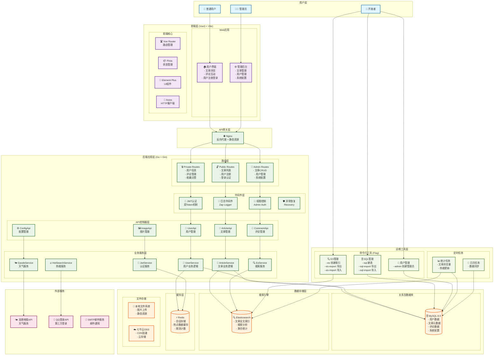
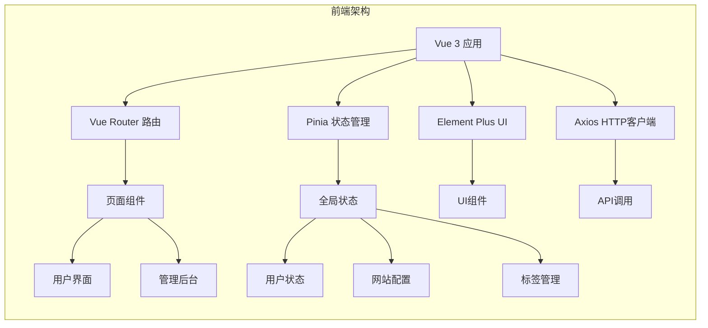
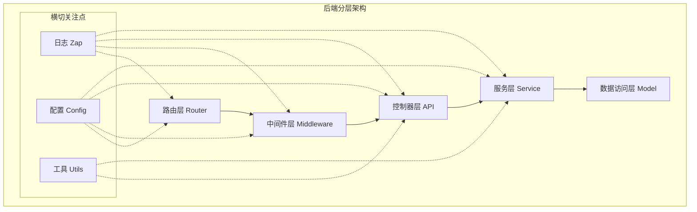
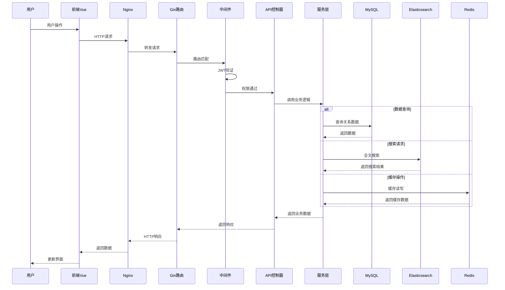
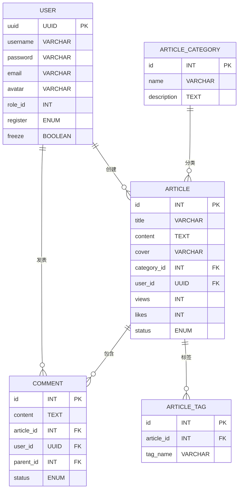
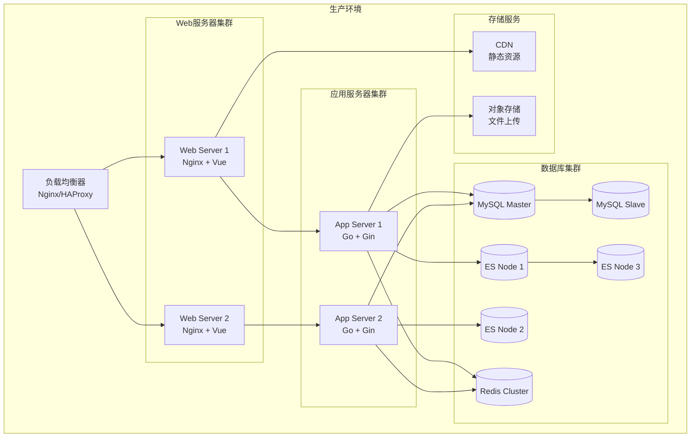

# MyBlog-ES 博客系统架构分析

## 项目概述

MyBlog-ES 是一个基于 Go + Vue3 的现代化博客系统，采用前后端分离架构，集成了 MySQL 和 Elasticsearch 双数据存储方案，提供了完整的博客管理功能。

## 技术栈

### 后端技术栈
- **语言**: Go 1.x
- **Web框架**: Gin
- **ORM**: GORM
- **数据库**: MySQL 8.0
- **搜索引擎**: Elasticsearch 8.x
- **缓存**: Redis
- **日志**: Zap
- **认证**: JWT双Token机制
- **配置管理**: Viper + YAML
- **命令行工具**: urfave/cli

### 前端技术栈
- **框架**: Vue 3.x
- **构建工具**: Vite
- **状态管理**: Pinia
- **UI组件库**: Element Plus
- **图表库**: ECharts
- **Markdown编辑器**: md-editor-v3
- **HTTP客户端**: Axios
- **语言**: TypeScript

## 系统架构图

## 核心模块详解

### 1. 前端架构 (Vue3 + TypeScript)

### 2. 后端分层架构

### 3. 数据流架构

### 4. 数据库设计

## 核心特性

### 1. 双数据存储架构
- **MySQL**: 存储结构化数据（用户、文章元数据、评论等）
- **Elasticsearch**: 提供全文搜索、聚合分析功能
- **Redis**: 缓存热点数据、会话存储

### 2. JWT双Token认证机制
- **Access Token**: 短期有效，用于API访问
- **Refresh Token**: 长期有效，用于刷新Access Token
- 支持多点登录控制

### 3. 命令行工具集成
- 数据库管理：建表、导入导出
- ES索引管理：创建、导入导出
- 用户管理：创建管理员

### 4. 完整的权限控制
- 公开路由：文章浏览、用户注册
- 私有路由：用户信息、评论管理
- 管理员路由：系统管理、内容审核

### 5. 现代化前端架构
- Vue 3 Composition API
- TypeScript 类型安全
- Vite 快速构建
- Element Plus 企业级UI

## 部署架构

## 总结

MyBlog-ES 是一个设计精良的现代化博客系统，具有以下优势：

1. **技术栈先进**: 采用 Go + Vue3 + TypeScript 的现代技术栈
2. **架构清晰**: 前后端分离，分层架构，职责明确
3. **性能优秀**: 双数据存储，缓存机制，搜索优化
4. **功能完整**: 用户管理、内容管理、搜索、评论等完整功能
5. **运维友好**: 命令行工具，日志系统，配置管理
6. **扩展性强**: 微服务架构，水平扩展能力

该系统适合作为企业级博客平台或个人技术博客的基础架构，具有良好的可维护性和扩展性。