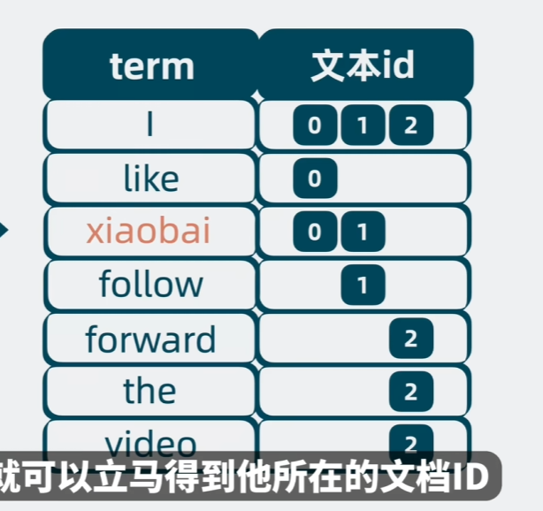
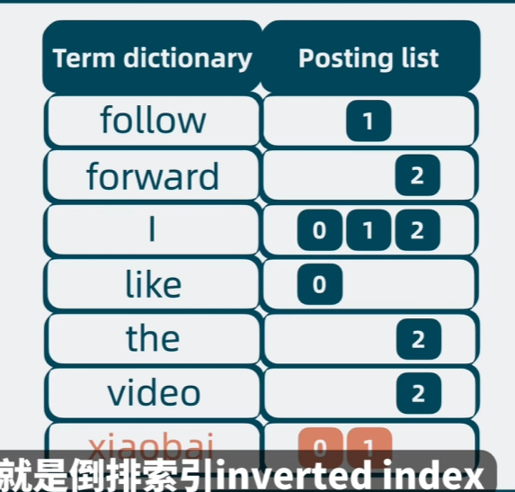
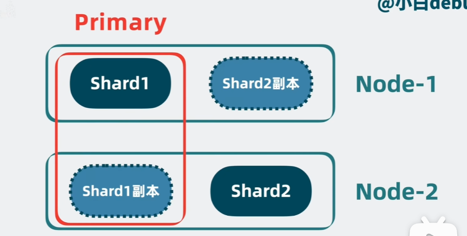
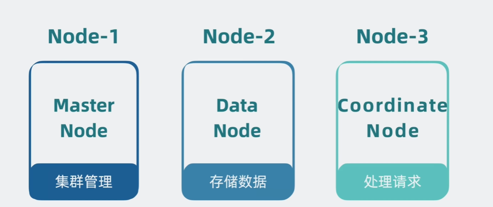
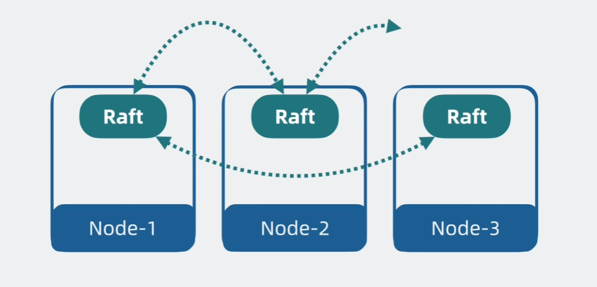
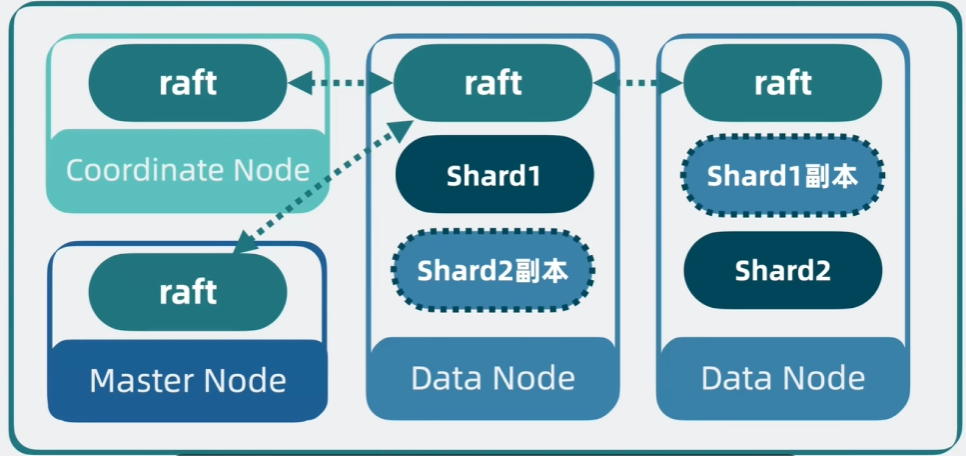
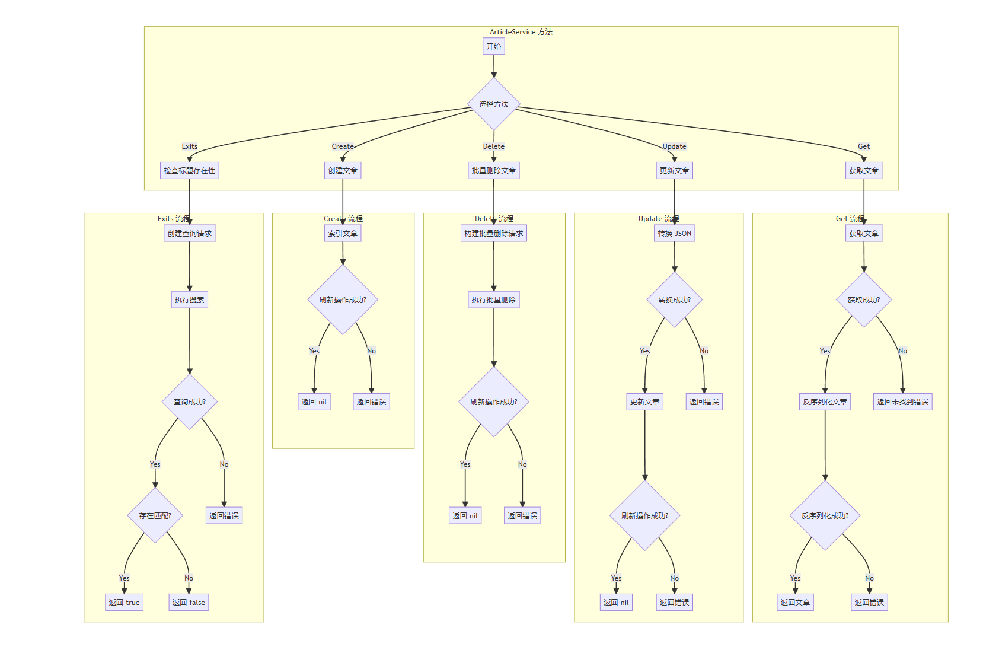

# 个人博客系统说明文档+ES学习笔记

## 目录
- [技术栈](#技术栈)
  - [后端](#后端)
  - [后端框架](#后端框架)
  - [前端](#前端)
- [项目框架(后端)](#项目框架后端)
- [技术栈学习](#技术栈学习)
  - [flag命令](#flag命令)
    - [flag命令的用法](#flag命令的用法)
    - [本项目中定义的flag命令](#本项目中定义的flag命令)
    - [本项目中flag命令的实现](#本项目中flag命令的实现)
      - [main函数调用flag初始化函数](#main函数调用flag初始化函数)
      - [InitFlag函数](#InitFlag函数)
      - [定义CLI标志](#定义CLI标志)
      - [基于传入的CLI指令执行响应的操作](#基于传入的CLI指令执行响应的操作)
      - [底层的admin函数](#底层的admin函数)
  - [zap日志](#zap日志)
  - [elasticsearch分布式搜索引擎](#elasticsearch分布式搜索引擎)
    - [分布式搜索引擎的作用](#分布式搜索引擎的作用)
    - [elasticsearch工作原理](#elasticsearch工作原理)
      - [倒排索引](#倒排索引)
      - [Stored Fields](#Stored Fields)
      - [Doc Values](#Doc Values)
      - [Segment](#Segment)
      - [Lucene](#Lucene)
      - [优化](#优化)
      - [Node角色分化](#Node角色分化)
      - [去中心化](#去中心化)
    - [本项目中的ES](#本项目中的ES)
      - [初始化es连接](#初始化es连接)
      - [数据分页](#数据分页)
      - [用于文章的CRUD](#用于文章的CRUD)
  - [JWT双token登录认证](#JWT双token登录认证)
    - [Access Token](#Access Token)
    - [Refresh Token](#Refresh Token)
    - [工作流程](#工作流程)
    - [图示说明](#图示说明)

## 技术栈
### 后端
1. Golang
2. Mysql
3. Redis
4. Elasticsearch(分布式搜索引擎)
5. zap日志
6. flag命令
### 后端框架
1. Gin+Gorm(数据库映射)
### 前端
1. Vue
2. Vite
3. Pinia
4. ElementPlus
5. ECharts


## 项目框架(后端)
```
├── server
├── api               (api层)
├── assets            (静态资源包)
├── config            (配置包)
├── core              (核心文件)
├── flag              (flag命令)
├── global            (全局对象)
├── initialize        (初始化)
├── log               (日志文件)
├── middleware        (中间件层)
├── model             (模型层)
│   ├── appTypes      (自定义类型)
│   ├── database      (mysql结构体)
│   ├── elasticsearch (es结构体)
│   ├── other         (其他结构体)
│   ├── request       (入参结构体)
│   └── response      (出参结构体)
├── router            (路由层)
├── service           (service层)
├── task              (定时任务包)
├── uploads           (文件上传目录)
└── utils             (工具包)
├── hotSearch    (热搜接口封装)
└── upload        (oss接口封装)
```

## 技术栈学习

### flag命令
### flag命令的用法
``
go run main.go + flag规定的参数名称
``<br>
比如只想执行建表操作，flag包中规定建表操作的参数为sql，那么命令如下：
``
go run main.go -sql
``<br>
### 本项目中定义的flag命令
1. "sql":执行建表语句
2. "sql-export"：导出sql表中数据
3. "sql-import"：导入sql表中数据
4. "es"：创建es索引
5. "es-export"： 导出es索引数据
6. "es-import"：导入es索引数据
7. "admin"：创建管理员账户
### 本项目中flag命令的实现 --以admin为例，由上层往下层展示
#### main函数调用flag初始化函数
```go
func main() {
	global.Config = core.InitConf()
	global.Log = core.InitLogger()
	initialize.OtherInit()
	global.DB = initialize.InitGorm()
	global.Redis = initialize.ConnectRedis()
	global.ESClient = initialize.ConnectEs()

	defer global.Redis.Close()、
	
    //TODO 这里调用了初始化flag命令的函数
	flag.InitFlag()

	initialize.InitCron()

	core.RunServer()
}
```
### InitFlag函数
初始化flagAPP,并且接收命令返回报错以及帮助信息
```go
func InitFlag() {
	if len(os.Args) > 1 {
		//TODO 将flag命令进行初始化
		app := NewApp()
		err := app.Run(os.Args)
		if err != nil {
			global.Log.Error("Application execution encountered an error:", zap.Error(err))
			os.Exit(1)
		}
		if os.Args[1] == "-h" || os.Args[1] == "-help" {
			fmt.Println("Displaying help message...")
		}
		os.Exit(0)
	}
}
```

### 定义CLI标志  基于不同标志执行不同操作
1. 定义CLI标志
```go
var (
	adminFlag = &cli.BoolFlag{
		Name :"admin",
		Usage: "Creates an administrator using the name, email and address specified in the config.yaml file.",
    }
)
```
2. 基于传入的CLI指令执行响应的操作
```go 
func Run(c *cli.Context){
	// 判断cli指令的数目是否大于1,如果大于1的话返回一次只能执行一个指令
	if c.NumFlags()>1{
        err := cli.NewExitError("Only one command can be specified", 1)
        global.Log.Error("Invalid command usage:", zap.Error(err))
        os.Exit(1)
    }
	switch{
	···
	case c.Bool(adminFlag.Name): 
		//执行下层的admin函数，如果报错返回报错原因
    if err := Admin(); err != nil {
        global.Log.Error("Failed to create an administrator:", zap.Error(err))
        } else {
            global.Log.Info("Successfully created an administrator")
        }
	···
	default:
		err:=cli.NewExitError("unknown command", 1)
		global.Log.Error(err.Error(), zap.Error(err))
    }
}
```
### 底层的admin函数
```go
// Admin 用于创建一个管理员用户
func Admin() error {
	var user database.User

	// 提示用户输入邮箱
	fmt.Print("Enter email: ")
	// 读取用户输入的邮箱
	var email string
	_, err := fmt.Scanln(&email)
	if err != nil {
		return fmt.Errorf("failed to read email: %w", err)
	}
	user.Email = email

	// 获取标准输入的文件描述符
	fd := int(syscall.Stdin)
	// 关闭回显，确保密码不会在终端显示
	oldState, err := term.MakeRaw(fd)
	if err != nil {
		return err
	}
	defer term.Restore(fd, oldState) // 恢复终端状态

	// 提示用户输入密码
	fmt.Print("Enter password: ")
	// 读取第一次输入的密码
	password, err := readPassword()
	fmt.Println()
	if err != nil {
		return err
	}

	// 提示用户再次输入密码进行确认
	fmt.Print("Confirm password: ")
	// 读取第二次输入的密码
	rePassword, err := readPassword()
	fmt.Println()
	if err != nil {
		return err
	}

	// 检查两次密码输入是否一致
	if password != rePassword {
		return errors.New("passwords do not match")
	}

	// 检查密码长度是否符合要求
	if len(password) < 8 || len(password) > 20 {
		return errors.New("password length should be between 8 and 20 characters")
	}

	// 填充用户数据
	user.UUID = uuid.Must(uuid.NewV4())
	user.Username = global.Config.Website.Name
	user.Password = utils.BcryptHash(password)
	user.RoleID = appTypes.Admin
	user.Avatar = "/image/avatar.jpg"
	user.Address = global.Config.Website.Address

	// 在数据库中创建管理员用户
	if err := global.DB.Create(&user).Error; err != nil {
		return err
	}

	return nil
}

// readPassword 用于读取密码并且避免回显
func readPassword() (string, error) {
	var password string
	var buf [1]byte

	// 持续读取字符直到遇到换行符为止
	for {
		_, err := os.Stdin.Read(buf[:])
		if err != nil {
			return "", err
		}
		char := buf[0]

		// 检查是否为回车键，若是则终止输入
		if char == '\n' || char == '\r' {
			break
		}

		// 将输入的字符附加到密码字符串中
		password += string(char)
	}

	return password, nil
}
```
### zap日志

以上是deepseek的回答，zap日志库的作用可以用go自带的原生框架代替，但是使用类似zap之类的库可以锻炼自己的代码能力，也可以更好的适配项目需求。
```go
package main

import (
	"go.uber.org/zap"
)

func main() {
	// 创建一个 Logger
	logger, _ := zap.NewProduction()
	defer logger.Sync() // 确保日志刷新到输出

	// 记录一条日志
	logger.Info("This is an info log",
		zap.String("key", "value"),
		zap.Int("count", 42),
	)

	// 使用 SugaredLogger
	sugar := logger.Sugar()
	sugar.Infof("User %s logged in at %s", "john", "2023-10-01")
}
```
具体的日志库选择可以根据自己的习惯进行选择。
### elasticsearch分布式搜索引擎
#### 分布式搜索引擎的作用
1. 举例来说，现在有三段文本
```
    I like xiaobai
    l follow xiaobai
    i forward the video
```
现在我要查找有字符串 "xiaobai" 的文本，那么如果使用传统的搜索引擎，那么需要将这三段文本都进行分词，然后将分词后的结果进行索引，然后再进行查询。这样的话，在上万条数据量级的程序中查询效率十分低下，这时就引入了elasticsearch。

### elasticsearch工作原理
elasticsearch介于应用与数据之间，只要将数据写入es，应用就可以通过关键词找到数据，那它怎么做到的？

#### 倒排索引
首先回到刚才的例子
我们将每个文本进行分词，分词后的每个部分我们称为一个词项（term），记录词项和文本ID的关系，那么上面的文本就变成下面这样：<br>
<br>
1. 当我们想要搜索“xiaobai”就可以检索到xiaobai词项对应的文本数为0，1。但是随着数据量的增长，词项数量会变得十分庞大，现在该怎么办呢？
2. 为了解决1的问题，我们将词项按照字典序排序，使用二分查找来寻找对应的词项，这样就将时间复杂度从O(n)降低到O(logn)，从而提高查询效率。我们将排好序的词项称为 **Term Dictionary**,儿排好序的文档
ID的集合称为 ***Posting list***<br>
 <br>
他们共同组成的数据结构就是倒排索引。但是Term Dictionary的数据量很大，不能存在内存中，只能存在磁盘中，但是读取磁盘的速度非常慢，有什么解决方法吗？
3. 为了解决2的问题，我们引入term index。<br>
我们发现Term Dictionary中有些前缀是相同的，比如follow和forward中前两个字母都是“fo”，如果我们可以将相同的前缀进行复用，就可以用更少的
空间表达更多的term。基于这个原理，我们将Term Dictionary中的部分词项提取出来，用这些词项的前缀信息构建出一个目录 **树**。如下图：<br>
<br>
这个目录书中的节点只记录词项在磁盘中的偏移量，因此体量很小，这样就可以存放在内存中了。

####  Stored Fields
上面的倒排索引已经帮我们找到了对应的文本ID，但是我们要继续找到对应的文本本身，因此需要有个地方存放完整的文档内容，这个地方就是 **Stored Fields**。<br>

#### Doc Values
有了ID我们就可以从Stored Fields中找到对应的文档。但是用户经常需要根据某个字段进行排序文档。
但是这字段散落在整个文档中，也就是说我们要先获取stored fields中的文档，再提取出内部字段进行排序，这样十分麻烦
，该如何解决这个问题呢？
1. 我们可以借鉴时间换空间的思路，将这些字段集中存放。当我们相对某个字段排序的时候，只需要将存放这个字段的地方一次性读取出来，再进行排序。
这个列式结构就是Doc Values。

#### Segment
上面提到的;
1. 倒排索引：用于搜索文本ID
2. Term Index：用于加速搜索
3. Stored Fields：用于获取完整的文档内容
4. Doc Values：用于加速排序
上面提到的所有结构共同组成了Segment。它是完成搜索的最小单元。<br>


#### Lucene
如果新增文档时还是写入到原来的Segment中，那就需要同时更新Segment中的多个数据结构，这样会影响并发读写时的性能。
那怎么办呢？<br>
1. 我们定个规矩：Segment一旦生成将不能再被修改，如果有新的文档想要写入，那就生成新的Segment。<br>但是随着Segment的增多，我们怎么知道数据存在哪个Segment中呢？
2. 为了解决1的问题，我们只需要并发读写多个Segment就好了，但是随着Segment增多，文件句柄可能会耗尽，该如何解决这个问题？
3. 为了解决2的问题，我们可以不定期合并多个小Segment变成一个大Segment，称为Segment Merging。
到这里，上面提到的多个Segment就构成了一个单机文本检索库 --Lucene。elasticsearch就是基于Lucene实现的。

#### 优化
仅仅基于Lucene的单机文本检索库距离高性能，高扩展性，高可用还差的很远。
1. 高性能：多个读写方对一个Lucene进行读写，存在资源抢夺，没有抢夺的读写方只能等待，十分浪费时间。<br>
        我们将写入的数据进行分类，每一类是一个index name，然后根据index name新增Lucene，将不同类数据写入到不同的Lucene中，读取数据时，搜索不同的index name，这就大大降低了单个lucene的压力。
但是单个lucene中的数据依然可能过多。于是我们将单个lucene中的同类数据进行分片（Shard），每个Shard分片相当于一个独立的lucene库，这样我们可以将多个读写任务分摊到多个Shard中。
2. 高扩展性：随着分片变多，如果分片都在一个机器上的话，就会导致单机cpu和内存过高。
        于是我们可以申请更多的机器，将分片部署在多台机器上，每一台机器就是一个Node。我们可以通过增加Node来缓解cpu和内存过高带来的系统性能问题。
3. 高可用：如果一个Node挂了，那么Node上的Shard就无法对外提供服务。 
        为了实现服务的高可用，我们可以给分片多加几个副本，将分片分为primary shard和replica shard。<br>
<br>
主分片会将数据同步给副本分片，副本分片既可以同时进行读操作，还能在主分片挂的时候升级成新的主分片。保证新桶正常运行，保证了系统的高可用。

#### Node角色分化
搜索架构需要支持的功能很多，既要负责管理集群，又要储存管理数据，还要处理客户端的请求。如果每个Node都支持这些功能
，那么当集群有数据压力需要扩容Node时，就会顺带把其他能力一起扩容，但是其实其他能力完全够用，这就有些浪费了。因此我们可以将这些Node拆开，给予不同Node不同的身份。

#### 去中心化 
上面提到了主节点，那就意味着还有个选主的过程，但现在每个Node都是独立的，需要有个机制协调Node间的数据。我们可以引入莫改过的Raft模块，在节点间同步数据，让所有节点看到的集群状态都是一致的。
<br>
#### ES(elasticsearch)是什么？
现在刚才那个简陋的Lucene就成立一个高性能，高扩展性，高可用支持持久化的分布式搜索引擎。<br>


### 本项目中的ES（Elastic Search）
***本项目中ES用于对文章和数据分页的操作。***
1. 初始化es连接，并返回一个es客户端
```go
func ConnectEs() *elasticsearch.TypedClient {
	esCfg := global.Config.ES
	cfg := elasticsearch.Config{
		Addresses: []string{esCfg.URL},
		Username:  esCfg.Username,
		Password:  esCfg.Password,
	}

	// 如果配置中指定了需要打印日志到控制台，则启用日志打印
	if esCfg.IsConsolePrint {
		cfg.Logger = &elastictransport.ColorLogger{
			Output:             os.Stdout, // 设置日志输出到标准输出（控制台）
			EnableRequestBody:  true,      // 启用请求体打印
			EnableResponseBody: true,      // 启用响应体打印
		}
	}

	// 创建一个新的 Elasticsearch 客户端
	client, err := elasticsearch.NewTypedClient(cfg)
	if err != nil {
		global.Log.Error("Failed to connect to Elasticsearch", zap.Error(err))
		os.Exit(1)
	}

	return client
}

```
2. 数据分页
```go
func EsPagination(ctx context.Context, option other.EsOption) (list []types.Hit, total int64, err error) {
	// 设置分页的默认值
	if option.Page < 1 {
		option.Page = 1 // 页码不能小于1，默认为1
	}
	if option.PageSize < 1 {
		option.PageSize = 10 // 每页记录数不能小于1，默认为10
	}

	// 设置 Elasticsearch 查询的分页值
	from := (option.Page - 1) * option.PageSize // 计算从哪一条记录开始
	option.Request.Size = &option.PageSize      // 设置每页的记录数
	option.Request.From = &from                 // 设置起始记录位置

	// 执行 Elasticsearch 搜索查询
	res, err := global.ESClient.Search().
		Index(option.Index).                       // 指定索引
		Request(option.Request).                   // 应用查询请求
		SourceIncludes_(option.SourceIncludes...). // 设置需要包含的字段
		Do(ctx)                                    // 执行查询
	if err != nil {
		return nil, 0, err // 如果查询失败，返回错误
	}

	// 提取查询结果
	list = res.Hits.Hits         // 获取查询结果中的文档
	total = res.Hits.Total.Value // 获取符合条件的文档总数
	return list, total, nil      // 返回查询结果和总文档数
}
```
4. 用于文章的CRUD
```go
func (articleService *ArticleService) Create(a *elasticsearch.Article) error {
	// 将文章索引到Elasticsearch中，并设置刷新操作为 true
	_, err := global.ESClient.Index(elasticsearch.ArticleIndex()).Request(a).Refresh(refresh.True).Do(context.TODO())
	return err
}

// Delete 用于删除 Elasticsearch 中的文章
func (articleService *ArticleService) Delete(ids []string) error {
	var request bulk.Request
	// 遍历文章ID，构建批量删除请求
	for _, id := range ids {
		request = append(request, types.OperationContainer{Delete: &types.DeleteOperation{Id_: &id}})
	}
	// 执行批量删除请求，并设置刷新操作为 true
	_, err := global.ESClient.Bulk().Request(&request).Index(elasticsearch.ArticleIndex()).Refresh(refresh.True).Do(context.TODO())
	return err
}

// Get 用于通过ID从 Elasticsearch 获取文章
func (articleService *ArticleService) Get(id string) (elasticsearch.Article, error) {
	var a elasticsearch.Article
	// 从Elasticsearch获取文章
	res, err := global.ESClient.Get(elasticsearch.ArticleIndex(), id).Do(context.TODO())
	if err != nil {
		return elasticsearch.Article{}, err
	}
	// 如果找不到该文档，则返回错误
	if !res.Found {
		return elasticsearch.Article{}, errors.New("document not found")
	}
	// 将返回的源数据反序列化为 Article 对象
	err = json.Unmarshal(res.Source_, &a)
	return a, err
}

// Update 用于更新文章数据
func (articleService *ArticleService) Update(articleID string, v any) error {
	// 将待更新的值转换为 JSON
	bytes, err := json.Marshal(v)
	if err != nil {
		return err
	}
	// 执行更新请求，并设置刷新操作为 true
	_, err = global.ESClient.Update(elasticsearch.ArticleIndex(), articleID).Request(&update.Request{Doc: bytes}).Refresh(refresh.True).Do(context.TODO())
	return err
}

// Exits 用于检查文章标题是否存在
func (articleService *ArticleService) Exits(title string) (bool, error) {
	// 创建查询请求，匹配标题字段
	req := &search.Request{
		Query: &types.Query{
			Match: map[string]types.MatchQuery{"keyword": {Query: title}},
		},
	}
	// 执行搜索查询，查找是否存在该标题的文章
	res, err := global.ESClient.Search().Index(elasticsearch.ArticleIndex()).Request(req).Size(1).Do(context.TODO())
	if err != nil {
		return false, err
	}
	// 如果存在该标题，返回 true
	return res.Hits.Total.Value > 0, nil
}
```


## JWT双token登录认证
***双Token认证是一种增强安全性的认证机制，通常使用两个Token：Access Token 和 Refresh Token。***
### Access Token
1. 作用：用于访问受保护的资源。

2. 有效期：较短（如几分钟到几小时）。

3. 存储：通常存储在客户端内存中，减少被盗风险。
### Refresh Token
1. 作用：用于获取新的Access Token。

2. 有效期：较长（如几天到几周）。

3. 存储：安全地存储在客户端（如HttpOnly Cookie）或服务器端。

### 工作流程
```
+-------------------+      1. 用户登录       +-------------------+
|                   | ---------------------> |                   |
|     客户端        | <--------------------- |  认证服务器       |
|                   |   返回Access Token    |                   |
|                   |   和Refresh Token     |                   |
+-------------------+                       +-------------------+
         |                                           ^
         | 2. 使用Access Token访问资源              |
         | ------------------------------------------
         v                                           |
+-------------------+                       +-------------------+
|                   | <--------------------- |                   |
|   资源服务器      |   返回受保护资源        |  认证服务器       |
|                   | ---------------------> |                   |
+-------------------+                       +-------------------+
         |                                           ^
         | 3. Access Token过期                      |
         | ------------------------------------------
         v                                           |
+-------------------+                       +-------------------+
|                   | ---------------------> |                   |
|     客户端        |   使用Refresh Token    |  认证服务器       |
|                   |   请求新的Access Token|                   |
|                   | <--------------------- |                   |
+-------------------+   返回新的Access Token +-------------------+
         |                                           ^
         | 4. 使用新的Access Token访问资源          |
         | ------------------------------------------
         v                                           |
+-------------------+                       +-------------------+
|                   | <--------------------- |                   |
|   资源服务器      |   返回受保护资源        |  认证服务器       |
|                   | ---------------------> |                   |
+-------------------+                       +-------------------+
```

### 图示说明
#### 用户登录：

1. 客户端发送用户名和密码到认证服务器。

2. 认证服务器验证后，返回Access Token和Refresh Token。

#### 访问资源：

1. 客户端使用Access Token访问资源服务器。

2. 资源服务器验证Token后返回受保护资源。

#### Access Token过期：

1. 当Access Token过期，客户端使用Refresh Token向认证服务器请求新的Access Token。

2. 认证服务器验证Refresh Token后，返回新的Access Token。

#### 使用新的Access Token访问资源：

1. 客户端使用新的Access Token访问资源服务器。

2. 资源服务器验证Token后返回受保护资源。
